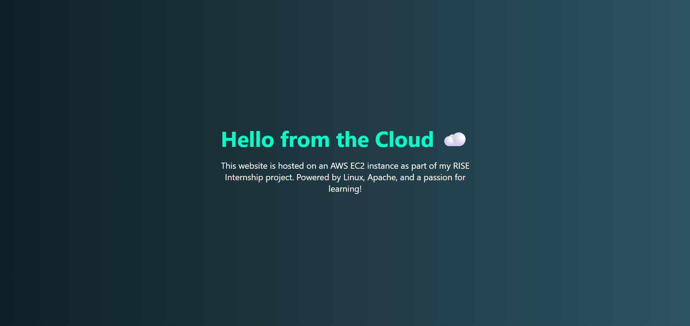

# Deploy Website on AWS EC2

## 🎯 Objective
Launch a Linux EC2 instance, install a web server (Apache/Nginx),
and host a basic HTML/CSS website.

## 🔧 Tools Used
- AWS EC2 (Free Tier)
- Ubuntu 22.04
- Apache
- Git & GitHub

## 🌐 Live Website
Deployed at: `http://<your-ec2-ip>`

## Screenshots
Here’s how the live website looks on EC2:

## 🔄 How It Works
This project involves launching a Linux-based EC2 instance on AWS and hosting a static HTML/CSS website using Apache. The EC2 instance acts as a remote server that can serve web content globally over the internet. After configuring the security group and web server, the site becomes publicly accessible through the instance's public IP address.

## 🧠 What I Learned
- How to create and configure an AWS EC2 instance
- Basics of Linux terminal commands and remote access using SSH
- How Apache works as a web server
- Hosting and updating static websites from the cloud