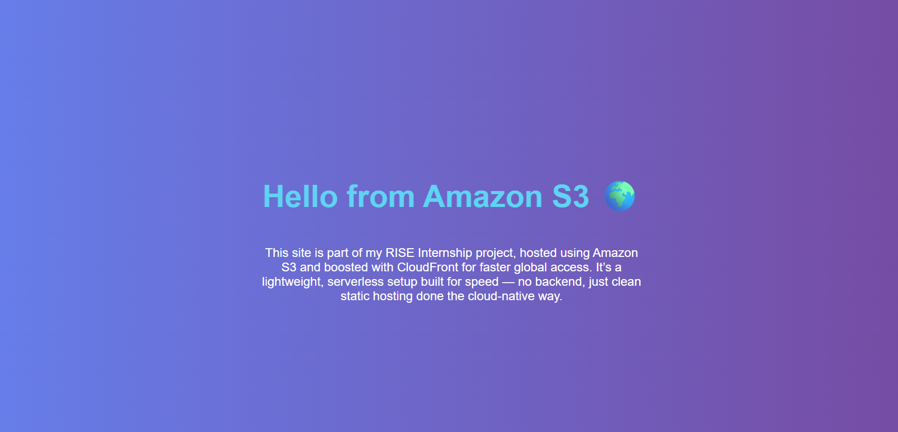

# Host Static Website with S3 & CloudFront

## 🎯 Objective
Host static content using S3 and deliver globally via CloudFront.

## 🛠 Tools & Technologies
- Amazon S3, CloudFront

## ✅ Expected Output
A fast, CDN-delivered static website.

## 🌐 Live Website (via CloudFront CDN)
[https://d3q2vue2f863z6.cloudfront.nett](https://d3q2vue2f863z6.cloudfront.net)

This site is part of my RISE Internship project, hosted on Amazon S3 and delivered using CloudFront for high-speed global access. A fully serverless and scalable deployment.

## 📸 Screenshot

