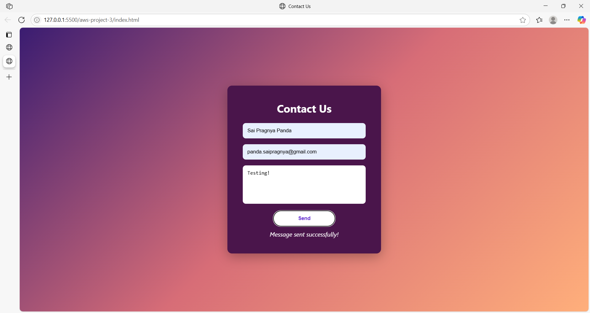

# Project 3 – Serverless Contact Form

## 🎯 Objective
Build a serverless contact form using HTML, JavaScript, AWS Lambda, and API Gateway.

## 🛠 Tools Used
- HTML & CSS
- JavaScript (Fetch API)
- AWS Lambda (Python 3.13)
- API Gateway (HTTP API)
- CloudWatch Logs

## 🚀 Live Demo
*Hosted locally*

## ✅ How It Works
- The user submits a form
- JavaScript sends the data to API Gateway
- API Gateway triggers a Lambda function
- Lambda logs or processes the message

## 🧠 What I Learned
- Building serverless APIs
- Handling JSON data in Lambda
- Using CORS properly with API Gateway
