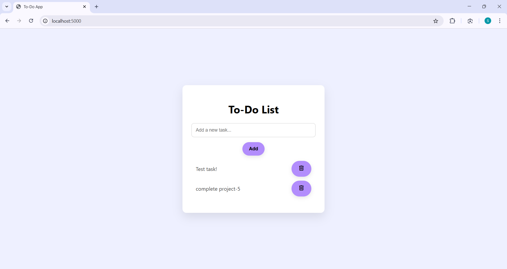
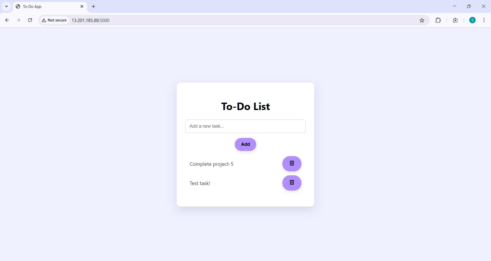

# Deploy Dockerized Flask App on AWS EC2

## 🎯 Objective
Containerize a Python Flask web app using Docker and deploy it on an AWS EC2 Ubuntu instance, making it publicly accessible via a web browser.

## 🔧 Tools Used
- AWS EC2 (Free Tier)
- Ubuntu 22.04
- Docker
- Python & Flask
- Git & GitHub

## 🌐 Live Demo
Deployed at: `http://<your-ec2-ip>:5000`  
(*Instance has been stopped to avoid unnecessary billing.*)

## 📸 Screenshots
Below Screenshot shows the testing in Docker

Here's a preview of the deployed app on EC2:  
(*To ensure cost-efficiency, I deactivated the EC2 instance used for Project 5 after testing.*) 

## 📹 Video explanation
[Click here to view the screen recording](https://drive.google.com/file/d/1IPB0dPFl_30CYkiWejiMpxUOMX_0SS0B/view?usp=sharing)

## 🔄 How It Works
- The To-Do app was built using Python’s Flask framework and styled with HTML/CSS.
- A `Dockerfile` was used to containerize the app, making it portable and consistent across environments.
- The container was built and run on an EC2 instance with Docker installed.
- The app listens on port `5000`, which was opened via EC2 security group settings to allow external access.

## 🧠 What I Learned
- Writing a functional web app using Flask
- Creating and structuring a `Dockerfile` for Python projects
- Installing and using Docker on Ubuntu EC2 instances
- Transferring project files from local machine to EC2 using `scp`
- Running, managing, and exposing Docker containers on AWS