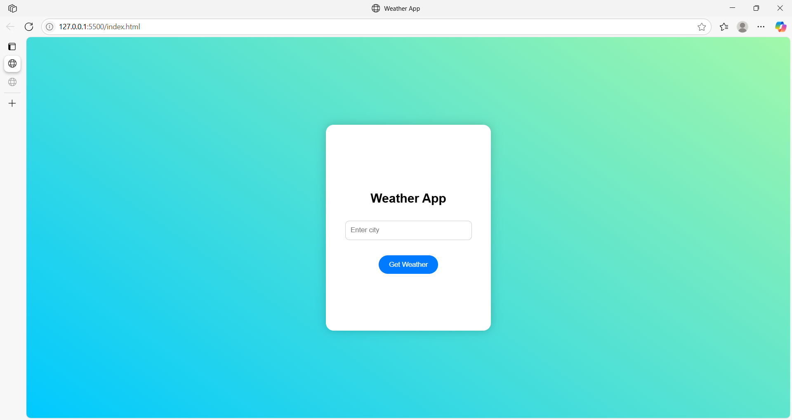

# Weather Forecast App 🌦️

## 🎯 Objective
Build a simple weather app using OpenWeatherMap API and display real-time weather for a searched city.

## 🔧 Tools Used
- HTML, CSS & JavaScript
- OpenWeatherMap API
- VS Code (Live Server)
- GitHub Actions for CI/CD
- GitHub Pages for deployment

## Try activity of API key in browser
https://api.openweathermap.org/data/2.5/weather?q=Delhi&appid=YOUR_API_KEY&units=metric  

## 🌐 Live Demo
🔗 [View Live Weather App](https://pragnya-2411.github.io/weather-app/)

🔗 [Weather App GitHub Repository](https://github.com/Pragnya-2411/weather-app)

## 📸 Video
(*locally deployed*)

## 📸 Screenshots
(*Deployed using gitHub*)

## 🔄 How It Works
- The user enters a city name and clicks "Get Weather".
- The app sends a request to the OpenWeatherMap API.
- Weather details are shown by flipping the card to the back.
- The "Back" button flips the card again for another search.

## 🧠 What I Learned
- Consuming a public REST API using JavaScript
- DOM manipulation
- CSS 3D card flipping
- Real-world weather data integration
